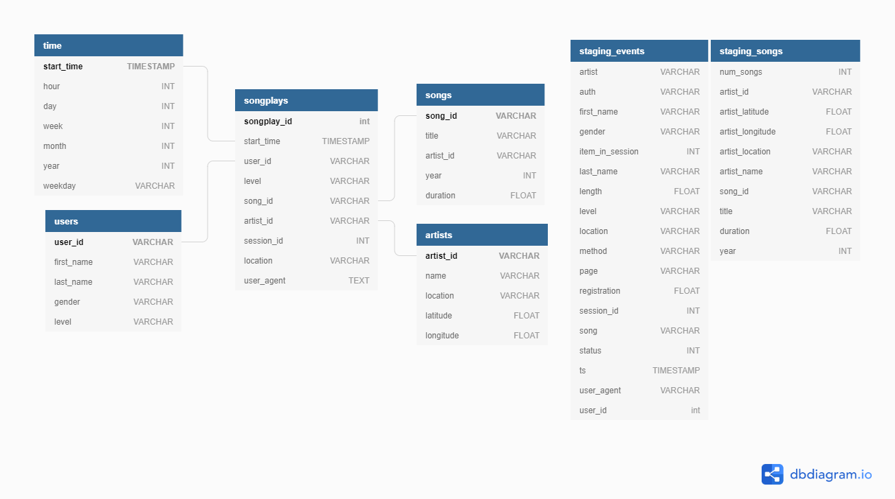

# Project: Data Modeling with Postgres
## Introduction
A music streaming startup, Sparkify, has grown their user base and song database and want to move their processes and data onto the cloud. Their data resides in S3, in a directory of JSON logs on user activity on the app, as well as a directory with JSON metadata on the songs in their app.

As their data engineer, you are tasked with building an ETL pipeline that extracts their data from S3, stages them in Redshift, and transforms data into a set of dimensional tables for their analytics team to continue finding insights in what songs their users are listening to. You'll be able to test your database and ETL pipeline by running queries given to you by the analytics team from Sparkify and compare your results with their expected results.

## Project Description
In this project, you'll apply what you've learned on data warehouses and AWS to build an ETL pipeline for a database hosted on Redshift. To complete the project, you will need to load data from S3 to staging tables on Redshift and execute SQL statements that create the analytics tables from these staging tables. 

## Requirements
In order to be able to run this project you need the following software/libraries:
- Python 3 (project built with version 3.6.3)
- Pandas (0.23.3)
- Psycopg2 (2.7.4)
- PostgreSQL

## Running the Project
The following commands need to be run in a terminal (in the given order):
1. Run cells from create_redshift_cluster.ipynb Jupyter Notebook
2. python create_tables.py
3. python etl.py

## Database Design
The database follows a star schema model where there is only one main Fact table referring to 4 different Dim tables. In order to put data into these tables, we require to create two more staging tables to prepare data before inserting it into our main star schema tables.

### Staging Tables
- Staging Events: Action related table
- Staging Songs: Songs and artists related table

### Fact Table
- Songplays: Stores activity of users

### Dim Tables
- Time: Time related information
- Users: Data about users registered in our app
- Songs: Important data of the song we store
- Artists: Important data of the artist we have

## ETL Process
The extract, transform and load (ETL) process starts when running the etl.py script of the project which executes the following steps:
1. Reads data from S3
2. Loads records into two staging tables by using some COPY INTO queries
2. Loads records to the fact and dim tables by using INSERT queries joining the staging tables

## Description of Files
### create_redshift_cluster.ipynb
Jupyter notebook used for automating the setup of IAM roles, policies and Redshift cluster before starting ETL process
### dwh.cfg
Configuration file where to provide DWH and AWS credentials
### create_tables.py
Python script that drops and creates all required tables
### etl.py
Python script that reads files from S3 to load their records into our dim and fact tables
### sql_queries.py
Python script containing all required SQL queries to execute our ETL process
